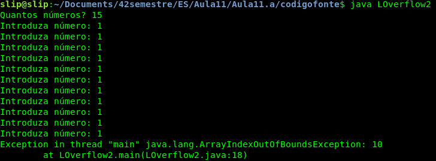
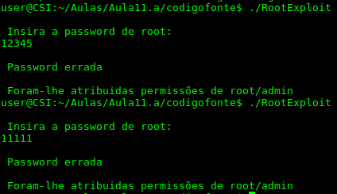

# Aula 11

## Pergunta 1.1

Analisando o programa ***LOverflow2*** escrito nas diferentes linguagens ,C++,Java e Python percebemos que este programa aloca um array de tamanho 10 e de seguida pergunta ao utilizador quantos números quer inserir no array e insere-os sem efetuar a validação de que o numero inserido é menor que o tamanho alocado . No caso do utilizador inserir mais números que o tamanho alocado inicialmente pelo programa  ira ocorrer um Buffer Overflow, uma vez que o programa irá escrever numa região de memoria que já não pertence ao buffer inicialmente alocada, sendo que cada linguagem irá reagir de maneira diferente.


No caso do programa C++ ocorre um erro de *stack smashing* como é ilustrado na imagem a baixo,


No caso do programa Java ocorre um exceção *Java.lang.ArrayIndexOutOfBoundsException* como é ilustrado na imagem a baixo



No caso do programa Python ocorre um erro *list assignment index out of range* como é ilustrado na imagem a baixo


## Pergunta 1.2

Analisando o programa ***LOverflow3*** escrito nas diferentes linguagens ,C++,Java e Python percebemos que este programa tal como o primeiro a aloca um array de tamanho 10, de seguida pergunta ao utilizador quantos elementos quer inserir no array e por fim tenta aceder a um dos elementos do array. Tal como no programa da alínea anterior como o input do utilizador nao é validado pode ocorrer um BufferOverflow caso o array seja preenchido ou acedido para além dos seus limites. 

No caso das linguagens Java e Python no caso do numero inserido ser superior ao tamanho do array o programa aborta com a mensagem de erro da alínea anterior.No caso do valor inserido ser inferior ou igual ao tamanho do array mas o índice acedido ser para alem do tamanho do array ambas as linguagens abortam o programa sem relevar os dados acedidos.

No caso do programa em C++ no caso do numero inserido pelo utilizador ser superior ao tamanho alocado o programa aborta com o erro da alínea anterior, no entanto imprime o numero que se encontra na posição do array que poderá estar para alem dos limites. No caso do numero inserido ser menor ou igual ao tamanho do array e o numero escolhido ser para além dos limites do array o programa retorna o valor em memoria e não ocorre qualquer erro.  


## Pergunta 1.3

Analisando o código ***RootExplot.c*** verificamos que este faz o uso da função *gets()* ,que não efetua a verificação de limites do array antes de o copiar.Deste modo se inserirmos um input com tamanho superior ao esperado iremos escrever sobre a variável *pass* e serão atribuídas permissões root. 




No código ***0-simple.c*** a vulnerabilidade de BufferOverflow também esta associada ao uso da função *gets()* tal como no exemplo anterior.O uso de um input de tamanho superior ao tamanho do array alocado faz com que a variável *control* seja reescrita levando a que o programa imprima a menagem *YOU WIN!!!*.


## Pergunta 1.4

Analisando o programa ***ReadOverflow.c***  o programa aloca uma buffer de tamanho 100 e pergunta ao utilizador quantos caracteres terá o input a inserir.Caso o tamanho inserido inserido pelo utilizador for superior ao tamanho do buffer e ao tamanho da frase o programa ler para além dos limites do buffer e o conteúdo da memoria será exposto como se pode observar na figura a baixo.Esta situação é designada de ReadOverflow.


## Pergunta 1.5	

Após verificar que a maquina virtual onde foram executados os programas utiliza *little endian*, ou seja o byte menos significativo é guardado na primeira posição de memória e o mais significativo na ultima, consultamos a tabela ASCII para obter os caracteres correspondes ao valor hexadecimal 0x61626364. Verificando que os caracteres são  a,b,c, e d inserimos um input de tamanho elevado para causar um BufferOverflow e concatenamos no final a string *dcba* que corresponde ao código hexadecimal de maneira a explorar a vulnerabilidade.


## Pergunta 2.1

Analisando o programa ***overflow.c*** verificamos que a vulnerabilidade presente na função *vulnerable*() está associada ao tipo de dados *size_t* que representa um inteiro de 16 bits.Uma vez que o numero de bits para a representação do inteiro é pequeno se forem utilizados valores muito altos para as variáveis *x* e *y* ocorrerá um IntegerOverflow fazendo com que a memoria alocada seja inferior á necessária e levando de seguida ao acesso de memória para além dos limites .

Para verificar esta vulnerabilidade foi alterada a função *main*, cuja código se encontra abaixo.

``` 
int main()
{
	char *matrix;
	vulneravel(matrix,100000000,100000000,'a');
}```
```

Após executar o programa verificamos que ocorre um erro de *segmentacion fault* tal como esperado-


## Pergunta 2.2

Analisando o programa ***underflow.c*** verificamos que a vulnerabilidade de Overflow já não pode ser explorada uma vez que agora existe uma verificação se o tamanho escolhido ultrapassa o valor máximo que pode ser guardado numa variável do tipo *size_t* .No entanto o facto de o tamanho ser decrementado uma unidade antes dos dados serem copiados permite nos efetuar um Underflow, uma vez que não é efetuada a verificação para valores de input negativos.

Para verificar esta vulnerabilidade foi alterada a função *main*, cuja código se encontra abaixo.

```
int main()
{
	vulneravel("underflow",0);
}```
```

Tal como na alínea anterior após executar o programa verificamos que ocorre um erro de *segmentacion fault*.

