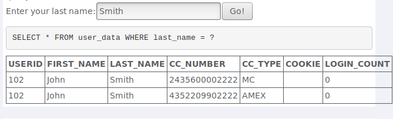
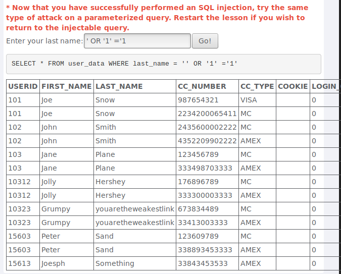
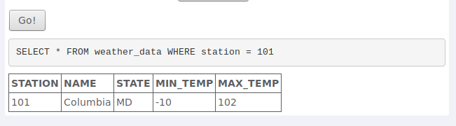
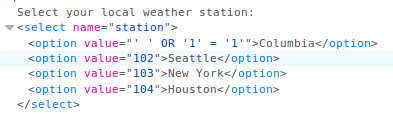
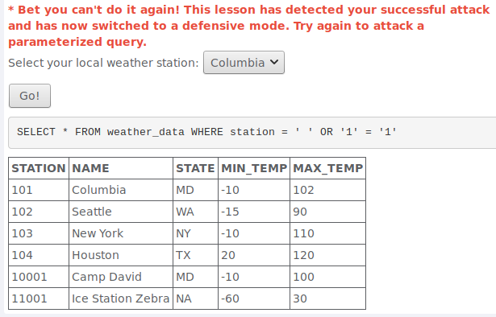
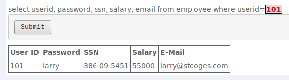
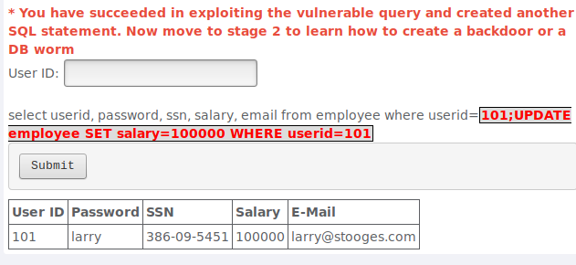
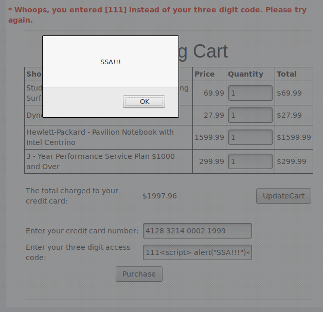
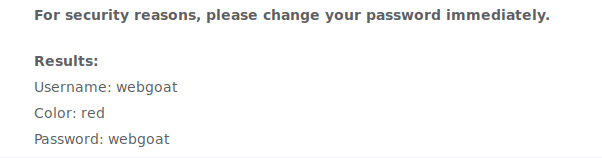
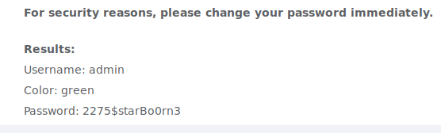

# Aula 12

## Pergunta 1.1

Ao inserir um nome comum, Smith tal como sugerido, o programa  apresenta um comportamento normal onde apresenta a informação referente ao utilizador inserido.

Utilizando a tautologia `1 = 1` como input é possível efetuar SQL Injection uma vez que a Query resultante  seleciona a informação dos utilizadores cujo último nome é '' ou 1=1 que faz match com todos os utilizadores.

## Pergunta 1.2

Analisando o comportamento normal do programa verificamos que a cidade inserida é traduzida para um número no caso da figura abaixo a cidade *Columbia* é traduzida para o número 101.

Uma vez que o input é definido pelo programa e não pelo utilizador é impossível efetuar SQL Injection utilizando uma tautologia uma vez que não conseguimos alterar o input. No entanto podemos alterar o HTML da pagina de maneira a que a tautologia seja executada quando é inserido um dos inputs da lista, como é demonstrado na figura abaixo.

Como podemos observar na imagem abaixo quando é selecionada a cidade  *Columbia* , cujo código HTML foi alterado, são apresentados os dados meteorológicos de todas as cidades 

## Pergunta 1.3

Analisando o comportamento normal do programa verificamos que é efetuada a Query demostrada na figura abaixo onde o input inserido pelo utilizador é utilizado para filtrar o utilizador.

Para explorar a vulnerabilidade de SQL Injection foi inserida depois do ID do utilizador uma Query SQL update que aumenta o salário para 1000000.

## Pergunta 2.1

Através de tentativa e erro verificamos que o campo onde são introduzidos 3 dígitos de código de acesso  não é validado pelo servidor sendo um potencial campo para efetuar Reflected XSS. Como podemos observar na figura abaixo foi possível executar o script inserido neste campo. 

## Pergunta 3.1 

A figura abaixo mostra o resultado de executar o programa com o input sugerido

De seguida foi utilizada a estratégia de força bruta para adivinhar a pergunta associada a conta do administrador. Esta estratégia consiste em experimentar diferentes cores até que seja adivinha a cor certa.

Após algumas tentativas foi possível adivinhar a cor  correta para a conta do administrador, tendo assim acesso à sua password como é demonstrado na figura abaixo.

