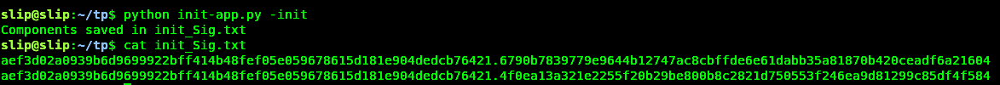
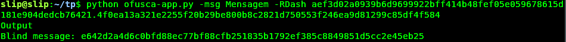
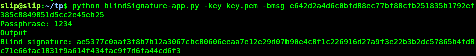
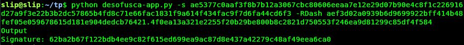
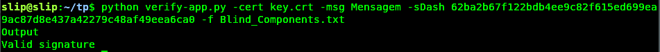
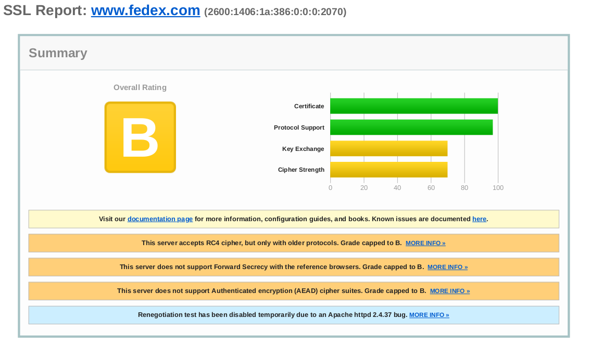
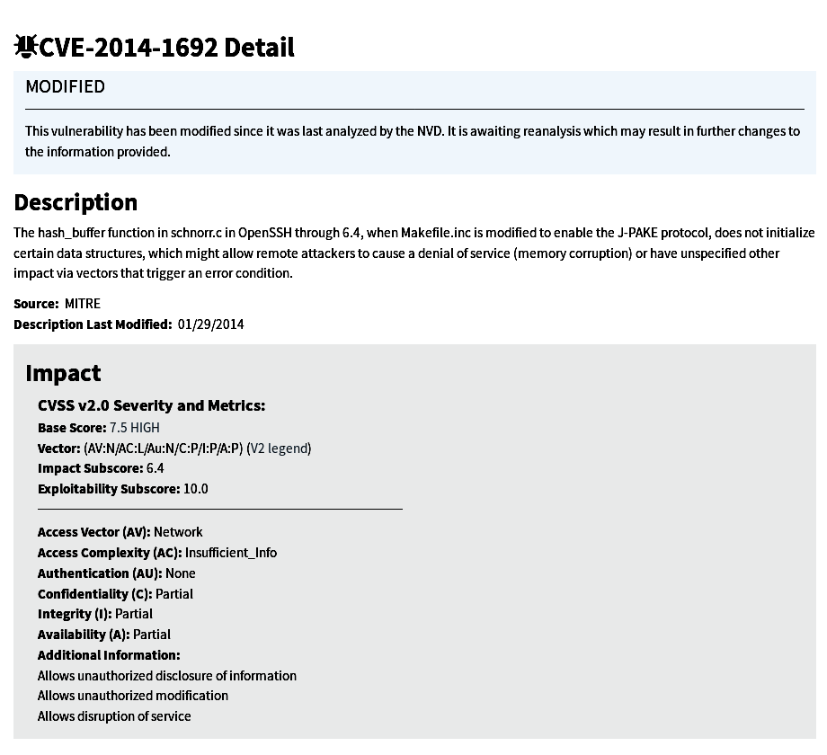
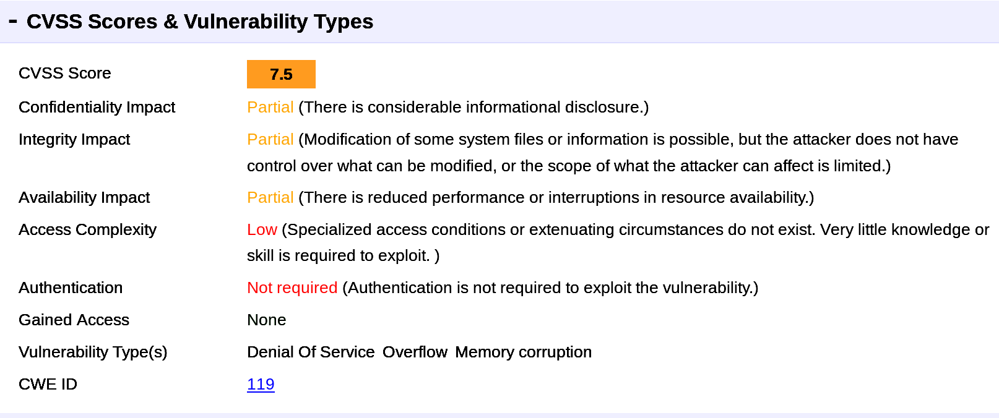

# Aula 3


## P1.1

Para simplificar a utilização das BlindSignatures foram efetuadas algumas alterações ao código fornecido,o novo código encontra -se na pasta [BlindSignature](./BlindSignature/),em baixo demonstramos a sua utilização.

 ###  Inicialização
 
  
 ###   Ofuscação
 
 
 ###   Assinatura
 
 
 ###   Desofuscação
 
 
 ###   Verificação
 


  
## P2.1

Os resultados obtidos no SSL Server test encontram-se na pasta [SSL_Server_test](./SSL_Server_test),e referem-se aos seguintes domínios:

- [*FedEx Corporation*](https://www.fedex.com/en-us/home.html)
- [*Red Hat Inc*](https://www.redhat.com/)
- [*Vmware Inc*](https://www.vmware.com/)

Analisando os resultados obtidos verificamos que o site que obtém o pior rating é o da FedEx Corporation com uma classificação de **B**.



Esta classificação é atribuída devido aos seguintes factos:

- This server accepts RC4 cipher, but only with older protocols.
- This server does not support Forward Secrecy with the reference browsers
- This server does not support Authenticated encryption (AEAD) cipher suites


Das cifras utilizadas no TLS 1.2 duas delas são consideradas inseguras nomeadamente as que utilizam o algoritmo RC4,embora que utilizado apenas em protocolos antigos.As restantes cifras são consideradas fracas uma vez que utilizam o AES no modo CBC.

- TLS_RSA_WITH_AES_128_CBC_SHA (0x2f) WEAK -
- TLS_RSA_WITH_AES_256_CBC_SHA (0x35) WEAK 
- TLS_RSA_WITH_3DES_EDE_CBC_SHA (0xa) WEAK 
- TLS_RSA_WITH_RC4_128_MD5 (0x4) INSECURE 
- TLS_RSA_WITH_RC4_128_SHA (0x5) INSECURE

O site não suporta o protocolo TLS 1.3 apenas suporta as versões 1.1 e 1.2,que não utilizam Authenticated encryption
para garantir a integridade e autenticidade dos dados e também não oferece Forward Secrecy,que possibilita conversações seguras sem que se dependa do private key do servidor.

**HTTP Public Key Pinning(HPKP)** é um mecanismo de segurança utilizado no HTTP header que permite a sites que utilizam HTTPS resistir a ataques MITM que utilizem certificados fraudulentos.Este mecanismo envia um conjunto do chaves publicas a um cliente (e.g. web browser) que são as únicas chaves de confiança a utilizar em futuras conexões com algum domínio durante um determinado periodo de tempo.
    
No entanto este mecanismo tem um conjunto de problemas associados como o RansomPKP attack,onde um atacante obtém o controlo de um site,comprometendo o servidor ou efetuando um domain hijack, para depois utilizar os header HPKP para fins maliciosos.Outra possível problema conhecido como HPKP Suicide acontece quando as chaves são acidentalmente eliminadas ou roubadas.
Analisando os resultados do SSL Server test verificamos que nenhuma das entidades referidas suporta este mecanismo no protocolo HTTP.
    


 


## P3.1

Utilizando o site shodan com os seguintes comandos

```
port:22 org:"VMware"
port:22 org:"FedEx"
```

foram escolhidos os seguites servidores SSH
- 185.45.163.188 para a VMware 
- 170.170.129.108 para a FedEx

Após correr o programa ssh_audit verificamos que os servidores utilizavam as seguintes versões do OpenSSL

- 185.45.163.188(VMware) utiliza **OpenSSH 4.4** 
- 170.170.129.108(FedEx) utiliza **OpenSSH_6.6p1**

Verificamos que a versão 4.4 do OpenSSH tem 16 vulnerabilidades como podemos observar em [*CVE_details OpenSSH-4.4*](https://www.cvedetails.com/vulnerability-list/vendor_id-97/product_id-585/version_id-38080/Openbsd-Openssh-4.4.html) e a versão 6.6p1 contem 6 vulnerabilidades como podemos observar em [*CVE_details OpenSSH-6.6p1*](https://www.cvedetails.com/vulnerability-list/vendor_id-97/product_id-585/version_id-188831/Openbsd-Openssh-6.6.html)

A versão que apresenta a vulnerabilidade mais grave é a versão 4.4 sendo que contem quatro CVEs com classificação de **7.5**,segundo o CVSS,sendo eles ```CVE-2014-1692```, ```CVE-2010-4478```, ```CVE-2007-4752``` e ```CVE-2006-5794```.

De seguida iremos analisar o ``CVE-2014-1692`` que é de entre as quatro a vulnerabilidade mais recente.




Analisando os resultados obtidos verificamos que esta vulnerabilidade deve-se ao facto da função hash_buffer presente no ficheiro schnorr.c nas versões do OpenSSH anteriores a 6.4 não inicializar algumas das estruturas quando é utilizado o protocolo J-PAKE.Isto possibilita que um atacante remoto efetue ataques de negação de serviço.

Visto isto podemos concluir que a vulnerabilidade é grave uma vez que afeta parcialmente a confidencialidade,integridade e disponibilidade do sistema,possibilitando que um atacante tenha acesso a informação privilegiada ou que altere informações e ficheiros no sistema.Para alem disso o atacante não necessita de estar autenticado para executar o ataque.

Esta vulnerabilidade pode ser resolvida fazendo uma atualização do OpenSSH para uma versão superior á 6.4.
