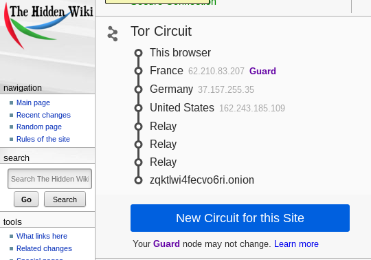

## Aula 4


### P1.1

Utilizando o comando ```sudo anonsurf start``` não conseguimos garantir que a localização final(nodo de saída) será nos EUA,isto deve-se ao facto do protocolo TOR,para garantir o anonimato do utilizador,estabelecer um circuito de forma aleatória entre os vários OR(Onion Routers) que se encontram no Directory Server.Neste processo o OP(Onion Proxy) efetua o acordo de chaves entre os OR que constituem o circuito,no entanto o OP não tem qualquer controlo sobre quais os OR que constituem o circuito.Para aumentar a anonimidade o circuito é alterado a cada minuto.
Deste modo a localização dos OR,incluido o OR de saida que determina a localização do utilizador,não pode ser escolhida pelo utilizador. 

### P1.2



Observando a imagem constatamos existência de 6 saltos no circuito TOR,isto deve-se ao facto do Hidden Wiki disponibilizar serviços anónimos.


O protocolo TOR possibilita a existência de serviços anónimos,nestes serviços os intervenientes (cliente e servidor) desconhecem o IP um do outro .Para que a comunicação entre entre ambos seja possível tem de ser criado um circuito com 6 saltos, em que os primeiros 3 OR representam o circuito criado pelo utilizador e os últimos 3,classificados de *Relays* correspondem ao circuito criado pelo servidor.

Este processo começa com o servidor a gerar uma chave de longo termo que será utilizada como identificador do serviço,de seguida escolhe um conjunto de Instruction Points e envia - os ao Directory server.Por fim o servidor cria um circuito para cada um dos Instruction Points,que ficaram a espera de pedidos.

O cliente sabe que o o serviço se encontra em xyz.com,e obtém através do Directory server a chave publica e os Instruction Points escolhidos pelo servidor.De seguida o cliente devera escolher um dos OR como ponto de rendezvous para aceder ao serviço xyz.com.Depois de definir o ponto de rendezvous o cliente cria um circuito até este ponto,criando assim a ligação entre o cliente e o servidor,fornecendo-lhe de seguido uma rendezvous cookie que será utilizada para reconhecimento do serviço.

De seguida o cliente cria uma stream anónima até um dos Instruction Points e envia lhe uma mensagem cifrada usando a chave publica de xyz.com,com informação relativa ao ponto de rendezvous,a rendezvous cookie e a inicialização do processo de troca de chaves DH.O  Instruction Point ira encaminhar a mensagem até ao serviço utilizando os circuitos criados anteriormente.

Quando o servidor pretender responder a um cliente cria um circuito até ao ponto de rendezvous e envia a rendezvous cookie,a finalização do acordo de chaves e um hash da chave de sessão partilhada com o cliente.
O ponto de rendezvous conecta o circuito do cliente ao circuito do servidor criando assim um circuito com 6 OR,3 do cliente incluindo o ponto de rendezvous, e 3 do servidor(Relays).